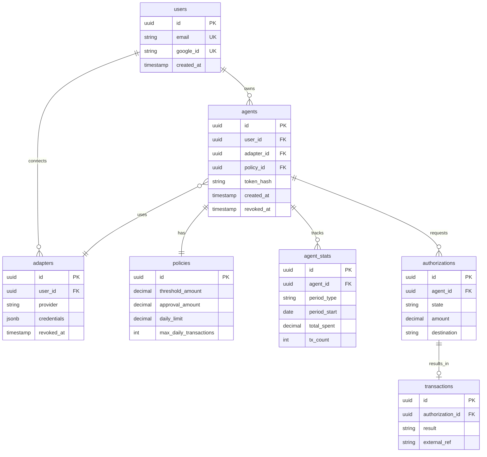

# PaySentry

> Authorization Gateway for AI Agent Payments

[]()
[](README.es.md)

## 🎯 What is PaySentry

PaySentry is authorization infrastructure for payments delegated to AI agents. Think of it as **OAuth but for money**: a user defines policies (limits, categories, merchants) and PaySentry validates each transaction before executing it.

```
┌────────┐      ┌─────────────┐      ┌────────────┐      ┌─────────┐
│ Agent  │  ->  │  PaySentry  │  ->  │  Payment   │  ->  │Purchase/│
│   AI   │      │ (validates) │      │ Processor  │      │Transfer │
└────────┘      └─────────────┘      └────────────┘      └─────────┘
                       |
                       v
                 ┌───────────┐
                 │   User    │
                 │ Policies  │
                 └───────────┘
```

## 🚧 Project Status

This project is in **architecture design phase**. The goal is to explore and document architecture patterns for distributed financial systems.

### Progress

| Phase | Status | Document |
|-------|--------|----------|
| Problem Statement | ✅ Complete | [01-problem.md](docs/01-problem.md) |
| Requirements | ✅ Complete | [02-requirements.md](docs/02-requirements.md) |
| Data Model | ✅ Complete | [03-data-model.md](docs/03-data-model.md) |
| ADRs | ✅ 5 complete | [docs/adr/](docs/adr/) |
| System Context (C4) | ⏳ Next | docs/architecture/ |
| API Spec | ⏳ Pending | docs/api/ |
| Implementation | ⏳ Pending | src/ |

### Architecture Decision Records (ADRs)

| ADR | Decision | Status |
|-----|----------|--------|
| [ADR-001](docs/adr/001-mock-adapter-mvp.md) | Mock Adapter for MVP | ✅ Accepted |
| [ADR-002](docs/adr/002-transactional-event-log.md) | Transactional Event Log | ✅ Accepted |
| [ADR-003](docs/adr/003-agent-token-storage.md) | Agent Token Storage (bcrypt) | ✅ Accepted |
| [ADR-004](docs/adr/004-atomic-aggregate-updates.md) | Atomic Aggregate Updates | ✅ Accepted |
| [ADR-005](docs/adr/005-payment-adapter-data-model.md) | Payment Adapter Data Model | ✅ Accepted |

## 📊 Data Model

The system uses PostgreSQL with normalized entities for policies and agents, and a unified event table for audit trail.


See [03-data-model.md](docs/03-data-model.md) for complete schema with constraints and indexes.

## 📚 Documentation

- **[docs/](docs/)** - Design documentation
- **[docs/adr/](docs/adr/)** - Architecture Decision Records
- **[docs/03-data-model.md](docs/03-data-model.md)** - Complete data model with SQL schema

## 🔑 Key Concepts

### Actors

| Actor | Description | Permissions |
|-------|-------------|------------|
| **User** | Money owner, defines policies | CRUD policies, approve transactions |
| **Agent** | AI that executes purchases | Only request authorization and capture |
| **Integrator** | Fintech/wallet integrating PaySentry | API access |

### Authorization Flow

1. User configures policy for an agent
2. Agent requests authorization (`POST /v1/authorizations`)
3. PaySentry evaluates against policy
4. If approved → agent captures (`POST /v1/authorizations/{id}/capture`)
5. PaySentry executes payment against processor
6. Transaction logged in audit trail

## 🛠️ Tech Stack (Proposed)

| Component | Technology |
|-----------|------------|
| Backend | Python (FastAPI) |
| Database | PostgreSQL |
| Cache | Redis |
| Payment Processor | MercadoPago (Mock Adapter for MVP) |
| Infrastructure | Railway/Render |

## 📖 References

- [Designing Data-Intensive Applications](https://dataintensive.net/) - Martin Kleppmann
- [MercadoPago API Docs](https://www.mercadopago.com.ar/developers)
- [C4 Model](https://c4model.com/) - Software architecture

## 👤 Author

Architectural project exploring patterns for financial authorization systems.

---

## Changelog

See [CHANGELOG.md](CHANGELOG.md) for change history.
