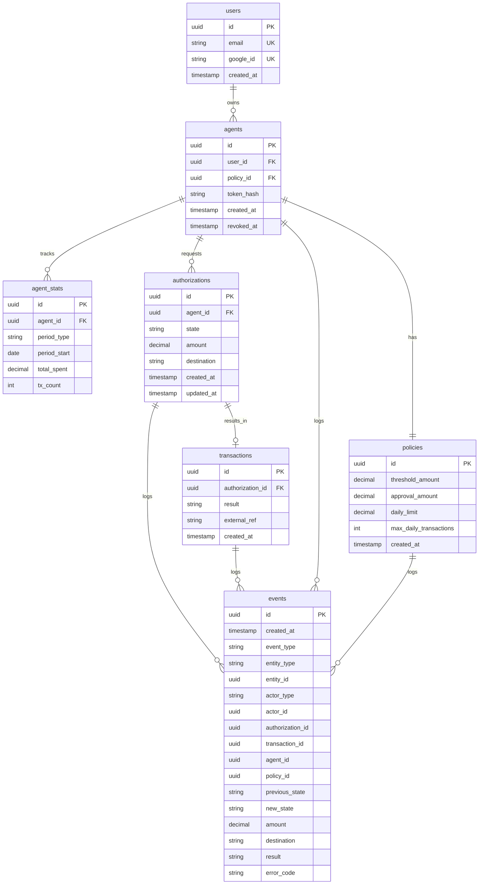

# Data Model

## Entity Relationship Diagram



---

## SQL Schema

### Core Entities

#### users
```sql
CREATE TABLE users (
    id UUID PRIMARY KEY DEFAULT gen_random_uuid(),
    email VARCHAR(255) NOT NULL UNIQUE,
    google_id VARCHAR(255) NOT NULL UNIQUE,
    created_at TIMESTAMP NOT NULL DEFAULT NOW()
);

CREATE INDEX idx_users_email ON users(email);
CREATE INDEX idx_users_google_id ON users(google_id);
```

**Design notes:**
- OAuth delegated to Google — no password storage
- `google_id` prevents issues if user changes email in Google
- Email indexed for user lookups during auth

---

#### agents
```sql
CREATE TABLE agents (
    id UUID PRIMARY KEY DEFAULT gen_random_uuid(),
    user_id UUID NOT NULL REFERENCES users(id) ON DELETE CASCADE,
    policy_id UUID NOT NULL REFERENCES policies(id) ON DELETE RESTRICT,
    token_hash VARCHAR(255) NOT NULL,
    created_at TIMESTAMP NOT NULL DEFAULT NOW(),
    revoked_at TIMESTAMP
);

CREATE INDEX idx_agents_user_id ON agents(user_id);
CREATE INDEX idx_agents_token_hash ON agents(token_hash);
```

**Design notes:**
- `token_hash` stores bcrypt hash (see ADR-003)
- `ON DELETE CASCADE` on user: delete agent if user deletes account
- `ON DELETE RESTRICT` on policy: prevent deleting policy while agent exists
- `revoked_at` NULL = active, NOT NULL = revoked

---

#### policies
```sql
CREATE TABLE policies (
    id UUID PRIMARY KEY DEFAULT gen_random_uuid(),
    threshold_amount DECIMAL(10,2) NOT NULL,
    approval_amount DECIMAL(10,2) NOT NULL,
    daily_limit DECIMAL(10,2) NOT NULL,
    max_daily_transactions INT NOT NULL,
    created_at TIMESTAMP NOT NULL DEFAULT NOW(),

    CONSTRAINT chk_threshold_lt_approval
        CHECK (threshold_amount < approval_amount),
    CONSTRAINT chk_positive_limits
        CHECK (daily_limit > 0 AND max_daily_transactions > 0)
);
```

**Design notes:**
- 1:1 with agent (one policy per agent in MVP)
- `threshold_amount` = requires manual approval if exceeded
- `approval_amount` = hard limit, reject if exceeded
- `daily_limit` = max cumulative spend per day
- `max_daily_transactions` = max transaction count per day
- Constraints enforce business rules at DB level

---

#### agent_stats
```sql
CREATE TYPE period_type AS ENUM ('daily', 'weekly', 'monthly');

CREATE TABLE agent_stats (
    id UUID PRIMARY KEY DEFAULT gen_random_uuid(),
    agent_id UUID NOT NULL REFERENCES agents(id) ON DELETE CASCADE,
    period_type period_type NOT NULL,
    period_start DATE NOT NULL,
    total_spent DECIMAL(10,2) NOT NULL DEFAULT 0,
    tx_count INT NOT NULL DEFAULT 0,

    CONSTRAINT uq_agent_period UNIQUE(agent_id, period_type, period_start),
    CONSTRAINT chk_non_negative CHECK (total_spent >= 0 AND tx_count >= 0)
);

CREATE INDEX idx_agent_stats_lookup ON agent_stats(agent_id, period_type, period_start);
```

**Design notes:**
- Separate table (not embedded in agent) for scalability
- `period_type` allows adding weekly/monthly stats without schema change
- Lazy reset pattern: row created on first transaction of new period (see ADR-004)
- UNIQUE constraint prevents duplicate stats for same period
- Updated atomically with authorization creation (see ADR-004)

---

### Transaction Flow

#### authorizations
```sql
CREATE TYPE authorization_state AS ENUM ('pending', 'approved', 'rejected', 'captured');

CREATE TABLE authorizations (
    id UUID PRIMARY KEY DEFAULT gen_random_uuid(),
    agent_id UUID NOT NULL REFERENCES agents(id) ON DELETE RESTRICT,
    state authorization_state NOT NULL DEFAULT 'pending',
    amount DECIMAL(10,2) NOT NULL,
    destination VARCHAR(255) NOT NULL,
    created_at TIMESTAMP NOT NULL DEFAULT NOW(),
    updated_at TIMESTAMP NOT NULL DEFAULT NOW(),

    CONSTRAINT chk_positive_amount CHECK (amount > 0)
);

CREATE INDEX idx_auth_agent_id ON authorizations(agent_id);
CREATE INDEX idx_auth_state ON authorizations(state);
CREATE INDEX idx_auth_created_at ON authorizations(created_at DESC);
```

**Design notes:**
- State flow: `pending` → `approved`/`rejected` → `captured` (if approved)
- `ON DELETE RESTRICT` prevents deleting agent with pending authorizations
- No user_id FK — derived via agent.user_id (normalized)
- Indexes support common queries:
  - Get all auths for agent
  - Get pending auths for manual approval
  - Get recent transactions (audit trail)

---

#### transactions
```sql
CREATE TYPE transaction_result AS ENUM ('success', 'failed');

CREATE TABLE transactions (
    id UUID PRIMARY KEY DEFAULT gen_random_uuid(),
    authorization_id UUID NOT NULL UNIQUE REFERENCES authorizations(id) ON DELETE RESTRICT,
    result transaction_result NOT NULL,
    external_ref VARCHAR(255),
    created_at TIMESTAMP NOT NULL DEFAULT NOW()
);

CREATE INDEX idx_tx_authorization_id ON transactions(authorization_id);
CREATE INDEX idx_tx_external_ref ON transactions(external_ref);
```

**Design notes:**
- 1:1 with authorization (one transaction per auth)
- UNIQUE on `authorization_id` enforces 1:1
- `external_ref` = ID from payment provider (MercadoPago/BIND)
- `result` = final outcome after calling external API
- No amount/destination — derived from authorization (normalized)

---

### Audit Trail

#### events
```sql
CREATE TYPE event_type AS ENUM (
    'AGENT_CREATED', 'AGENT_REVOKED',
    'POLICY_CREATED', 'POLICY_UPDATED', 'POLICY_DELETED',
    'AUTH_REQUESTED', 'AUTH_APPROVED', 'AUTH_REJECTED', 'AUTH_CAPTURED',
    'TX_EXECUTED', 'TX_FAILED'
);

CREATE TYPE actor_type AS ENUM ('user', 'agent', 'system');

CREATE TYPE entity_type AS ENUM ('agent', 'policy', 'authorization', 'transaction');

CREATE TABLE events (
    id UUID PRIMARY KEY DEFAULT gen_random_uuid(),
    created_at TIMESTAMP NOT NULL DEFAULT NOW(),
    event_type event_type NOT NULL,
    entity_type entity_type NOT NULL,
    entity_id UUID NOT NULL,
    actor_type actor_type NOT NULL,
    actor_id UUID NOT NULL,

    -- Sparse columns (only populated when applicable)
    authorization_id UUID REFERENCES authorizations(id),
    transaction_id UUID REFERENCES transactions(id),
    agent_id UUID REFERENCES agents(id),
    policy_id UUID REFERENCES policies(id),
    previous_state VARCHAR(50),
    new_state VARCHAR(50),
    amount DECIMAL(10,2),
    destination VARCHAR(255),
    result VARCHAR(50),
    error_code VARCHAR(50)
);

CREATE INDEX idx_events_entity ON events(entity_type, entity_id);
CREATE INDEX idx_events_created_at ON events(created_at DESC);
CREATE INDEX idx_events_actor ON events(actor_type, actor_id);
```

**Design notes:**
- Append-only (never UPDATE or DELETE)
- Unified table with sparse columns (70% will be NULL per row)
- No schema enforcement on which columns apply to which event_type — validated in application layer
- Indexes support:
  - Get all events for entity (e.g., full history of auth_123)
  - Chronological audit trail
  - Get all actions by user/agent

---

## Data Normalization Decisions

| Decision | Rationale |
|----------|-----------|
| **No user_id in transactions** | Derived via authorization.agent_id.user_id — avoid redundancy |
| **No amount/destination in transactions** | Derived via authorization — single source of truth |
| **Separate agent_stats table** | Allows multiple period types without schema change |
| **Sparse columns in events** | Trade-off: simpler queries vs storage efficiency. Acceptable for audit log. |
| **1:1 policy per agent** | Simplicity for MVP. Denormalized if multiple agents share policy (acceptable for low volume). |

---

## Query Patterns Validation

### 1. Validate payment request (authorization flow)
```sql
-- Get agent + policy
SELECT a.*, p.*
FROM agents a
JOIN policies p ON a.policy_id = p.id
WHERE a.id = ?;

-- Get daily stats
SELECT * FROM agent_stats
WHERE agent_id = ?
  AND period_type = 'daily'
  AND period_start = CURRENT_DATE;

-- Update stats atomically (in same transaction as INSERT authorization)
UPDATE agent_stats
SET total_spent = total_spent + ?,
    tx_count = tx_count + 1
WHERE agent_id = ?
  AND period_type = 'daily'
  AND period_start = CURRENT_DATE;
```

### 2. Get user's agents (dashboard)
```sql
SELECT a.*, p.*
FROM agents a
JOIN policies p ON a.policy_id = p.id
WHERE a.user_id = ?
  AND a.revoked_at IS NULL;
```

### 3. Get pending authorizations (manual approval UI)
```sql
SELECT a.*, ag.*, u.email
FROM authorizations a
JOIN agents ag ON a.agent_id = ag.id
JOIN users u ON ag.user_id = u.id
WHERE a.state = 'pending'
  AND u.id = ?
ORDER BY a.created_at DESC;
```

### 4. Get transaction history (audit trail)
```sql
SELECT a.*, t.*, ag.id as agent_id
FROM authorizations a
LEFT JOIN transactions t ON t.authorization_id = a.id
JOIN agents ag ON a.agent_id = ag.id
WHERE ag.user_id = ?
ORDER BY a.created_at DESC
LIMIT 50;
```

### 5. Reconstruct authorization history (compliance)
```sql
SELECT * FROM events
WHERE entity_type = 'authorization'
  AND entity_id = ?
ORDER BY created_at ASC;
```

---

## Storage Estimates (MVP scale)

Assumptions:
- 100 users
- 200 agents (2 per user average)
- 1000 authorizations/month
- 10 events per authorization average

| Table | Rows (month 1) | Row size | Total |
|-------|----------------|----------|-------|
| users | 100 | 0.5 KB | 50 KB |
| agents | 200 | 0.5 KB | 100 KB |
| policies | 200 | 0.3 KB | 60 KB |
| agent_stats | 200 | 0.3 KB | 60 KB |
| authorizations | 1000 | 0.5 KB | 500 KB |
| transactions | 800 | 0.3 KB | 240 KB |
| events | 10000 | 0.4 KB | 4 MB |
| **Total** | | | **~5 MB/month** |

At this scale, any PostgreSQL free tier (Supabase, Railway) is sufficient.

---

## Migration Strategy

### Initial schema creation
```sql
-- 1. Create enums
CREATE TYPE period_type AS ENUM (...);
CREATE TYPE authorization_state AS ENUM (...);
CREATE TYPE transaction_result AS ENUM (...);
CREATE TYPE event_type AS ENUM (...);
CREATE TYPE actor_type AS ENUM (...);
CREATE TYPE entity_type AS ENUM (...);

-- 2. Create tables without FKs
CREATE TABLE users (...);
CREATE TABLE policies (...);
CREATE TABLE agents (...);
CREATE TABLE agent_stats (...);
CREATE TABLE authorizations (...);
CREATE TABLE transactions (...);
CREATE TABLE events (...);

-- 3. Add foreign keys
ALTER TABLE agents ADD CONSTRAINT fk_agents_user ...;
ALTER TABLE agents ADD CONSTRAINT fk_agents_policy ...;
-- (etc)

-- 4. Create indexes
CREATE INDEX idx_users_email ...;
CREATE INDEX idx_agents_user_id ...;
-- (etc)
```

### Future schema changes
- Add `weekly`/`monthly` to period_type enum
- Add new event types without changing table structure
- Add merchant category support: new column in policies + authorizations

---

## References

- ADR-002: Transactional Event Log
- ADR-003: Agent Token Storage Strategy
- ADR-004: Atomic Aggregate Updates
- DDIA Chapter 3: Storage and Retrieval (indexes)
- DDIA Chapter 7: Transactions (ACID guarantees)
