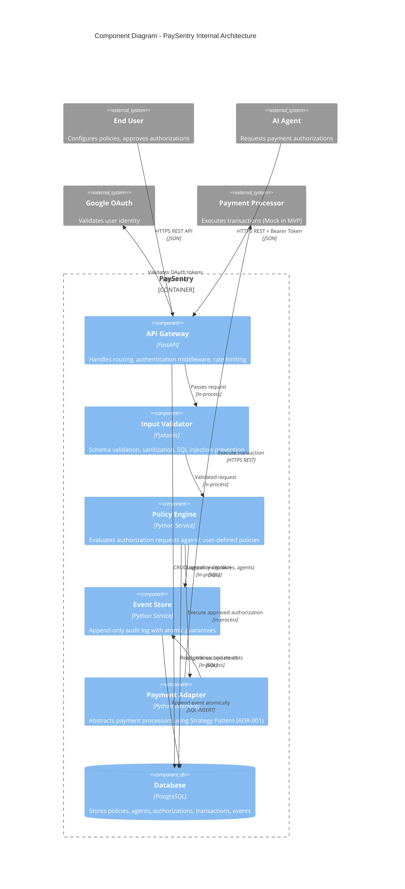

# Component Diagram (C4 Level 2)

## Overview

This diagram shows the internal structure of PaySentry, breaking down the system into components with distinct responsibilities.

**Purpose:** Define component boundaries, responsibilities, and interactions within PaySentry.

---

## Diagram



---

## Components

### 1. API Gateway
**Technology:** FastAPI
**Responsibilities:**
- HTTP request routing to appropriate handlers
- Authentication middleware (validates JWT for users, bcrypt-hashed tokens for agents - ADR-003)
- Rate limiting (post-MVP)
- CORS handling
- Response serialization

**Interfaces:**
- **IN:** HTTPS REST API from Users and Agents
- **OUT:** Calls to Input Validator, Google OAuth (for token exchange), Database (for CRUD operations)

**Design Notes:**
- Uses FastAPI's `Depends()` for dependency injection (auth validation)
- Lightweight layer — no business logic, only routing and cross-cutting concerns

---

### 2. Input Validator
**Technology:** Pydantic
**Responsibilities:**
- Schema validation (required fields, data types, formats)
- Input sanitization (trim whitespace, normalize currencies)
- SQL injection prevention (Pydantic models → ORM params, never raw SQL with user input)
- Business constraint validation (e.g., amount > 0, valid currency codes)

**Interfaces:**
- **IN:** Parsed request from API Gateway
- **OUT:** Validated request object to Policy Engine

**Design Notes:**
- Fails fast: rejects invalid requests before touching business logic
- Returns HTTP 400 with detailed error messages (field-level validation errors)
- Pydantic models define "shape" of valid requests (auto-generated OpenAPI schema)

---

### 3. Policy Engine
**Technology:** Python Service Layer
**Responsibilities:**
- **Core business logic** — evaluates authorization requests against policies
- Fetches applicable policies for a given agent
- Validates against limits:
  - Per-transaction max amount
  - Daily spending limit (uses materialized `agent_stats` - ADR-004)
  - Allowed recipients (CBU/alias whitelist)
  - Merchant category restrictions (post-MVP)
- Determines authorization state:
  - `approved` (auto-approved, below threshold)
  - `pending` (requires manual approval)
  - `denied` (violates policy)
- Updates `agent_stats` atomically in same transaction (ADR-004)

**Interfaces:**
- **IN:** Validated authorization request from Input Validator
- **OUT:**
  - Calls Payment Adapter if `approved`
  - Calls Event Store to log decision
  - Updates Database (authorization record, agent_stats)

**Design Notes:**
- **Stateless** — all state in Database, enables horizontal scaling
- **Atomic operations** — policy validation + stats update + event log in single PostgreSQL transaction (ADR-002)
- **Idempotent** — same request twice produces same result (checks for duplicate `idempotency_key`)

---

### 4. Payment Adapter
**Technology:** Python Abstract Interface (Strategy Pattern)
**Responsibilities:**
- Abstracts payment processor implementations
- Provides uniform interface: `execute_transaction(amount, recipient, metadata) → Result`
- Implementations:
  - **MockAdapter** (MVP) — in-memory simulation, always succeeds
  - **BINDAdapter** (post-MVP) — BIND APIBank integration
  - **MercadoPagoAdapter** (future) — if API supports transfers

**Interfaces:**
- **IN:** Execution request from Policy Engine
- **OUT:**
  - Calls external Payment Processor API (or mock simulation)
  - Calls Event Store to log transaction result

**Design Notes:**
- **Hexagonal Architecture** (ADR-001): business logic depends on abstraction, not concrete implementation
- Adapter selected at runtime based on `adapters.provider` field in DB
- Error handling: wraps processor-specific errors into uniform `TransactionResult` type

---

### 5. Event Store
**Technology:** Python Service Layer + PostgreSQL
**Responsibilities:**
- Append-only audit log (immutable event history)
- Guarantees atomicity: event logging is part of DB transaction (ADR-002)
- Populates event metadata:
  - `event_type` (authorization_created, policy_evaluated, transaction_executed, etc.)
  - `actor_id` (user or agent that triggered event)
  - `timestamp` (server-side, not client-provided)
  - `event_data` (JSON with type-specific fields)

**Interfaces:**
- **IN:** Log requests from Policy Engine, Payment Adapter
- **OUT:** SQL INSERT to `events` table in Database

**Design Notes:**
- **Atomic guarantee** (ADR-002): if `events` INSERT fails, entire transaction rolls back
- No UPDATE/DELETE operations — events are immutable
- Enables event sourcing: authorization state can be reconstructed from event history
- Compliance requirement: 100% audit trail for financial operations

---

### 6. Database
**Technology:** PostgreSQL (Supabase managed)
**Responsibilities:**
- Persists all entities: `users`, `agents`, `policies`, `adapters`, `authorizations`, `transactions`, `events`, `agent_stats`
- Enforces data integrity: foreign keys, CHECK constraints, unique indexes
- Provides transactional guarantees (ACID)

**Interfaces:**
- **IN:** SQL queries from all components
- **OUT:** Query results

**Design Notes:**
- Single database (no distributed transactions needed for MVP)
- Schema defined in `docs/03-data-model.md`
- Migrations managed by Alembic (versioned schema evolution)
- **SPOF risk** (ADR-002): if DB is down, entire system is unavailable

---

## Component Interactions

### Example Flow: `POST /v1/authorizations` (Happy Path)

```
1. Agent → API Gateway
   - POST /v1/authorizations with Bearer token

2. API Gateway → API Gateway (auth middleware)
   - Validates Bearer token (bcrypt.verify against hashed token in DB)
   - Extracts agent_id from token

3. API Gateway → Input Validator
   - Passes parsed request body

4. Input Validator → Input Validator
   - Validates schema (amount, recipient, idempotency_key required)
   - Checks amount > 0, recipient format valid

5. Input Validator → Policy Engine
   - Passes validated AuthorizationRequest object

6. Policy Engine → Database
   - BEGIN TRANSACTION
   - SELECT policy for agent_id
   - SELECT agent_stats for daily limit check

7. Policy Engine → Policy Engine
   - Evaluates rules: amount <= per_tx_max, daily_spent + amount <= daily_limit
   - Decision: approved (below threshold)

8. Policy Engine → Payment Adapter
   - execute_transaction(amount, recipient)

9. Payment Adapter → Payment Processor (external)
   - POST /transfers (or mock simulation)
   - Result: success

10. Payment Adapter → Event Store
    - log_event(type="transaction_executed", result="success")

11. Event Store → Database
    - INSERT INTO events (still in same transaction)

12. Policy Engine → Database
    - UPDATE agent_stats SET daily_spent = daily_spent + amount
    - INSERT INTO authorizations (state="approved")
    - INSERT INTO transactions (result="success")
    - COMMIT TRANSACTION

13. Policy Engine → API Gateway
    - Returns AuthorizationResponse(id, state="approved")

14. API Gateway → Agent
    - HTTP 201 Created with authorization details
```

**Key guarantees:**
- **Atomicity:** Steps 6-12 in single transaction (ADR-002, ADR-004)
- **Idempotency:** If same `idempotency_key` sent twice, step 6 detects duplicate and returns existing authorization
- **Audit completeness:** If step 11 fails, transaction rolls back (no authorization created without event)

---

## Design Patterns Applied

| Pattern | Component | Rationale |
|---------|-----------|-----------|
| **Layered Architecture** | All components | Clear separation: API → Validation → Business Logic → Data Access |
| **Strategy Pattern** | Payment Adapter | Swap payment processor without changing business logic (ADR-001) |
| **Dependency Injection** | API Gateway | FastAPI `Depends()` for auth, DB session management |
| **Repository Pattern** | Database access | Abstracts SQL queries (ORM layer), enables testability |
| **Event Sourcing** | Event Store | Immutable event log enables audit trail and state reconstruction |

---

## Separation of Concerns

| Concern | Component(s) | Why Separated |
|---------|-------------|---------------|
| **HTTP protocol** | API Gateway | Business logic doesn't know about HTTP status codes, headers |
| **Input validation** | Input Validator | Policy Engine assumes input is valid, simplifies business logic |
| **Business rules** | Policy Engine | Can change policies without touching API or DB layers |
| **External integrations** | Payment Adapter | Swap payment processors without rewriting Policy Engine |
| **Audit compliance** | Event Store | Guarantees event logging even if business logic changes |
| **Data persistence** | Database | Can switch from PostgreSQL to MySQL without changing service layer |

---

## Technology Choices

| Component | Technology | Alternative Considered | Why Chosen |
|-----------|------------|------------------------|------------|
| API Gateway | FastAPI | Flask, Django REST | Type hints + auto OpenAPI + async support |
| Input Validator | Pydantic | Marshmallow, Cerberus | Native FastAPI integration, best-in-class validation |
| Database | PostgreSQL | MySQL, MongoDB | ACID guarantees, JSON support, mature ecosystem |
| ORM | SQLAlchemy (future) | Raw SQL, Tortoise ORM | Industry standard, Alembic migrations |

---

## Connections to DDIA

### Chapter 1: Reliability, Scalability, Maintainability
- **Reliability:** Event Store guarantees audit completeness even during failures
- **Scalability:** Policy Engine is stateless → horizontal scaling by adding instances
- **Maintainability:** Layered architecture → change Input Validator without touching Policy Engine

### Chapter 3: Storage and Retrieval
- Materialized `agent_stats` (ADR-004) trades write amplification for O(1) reads
- Indexes on `(agent_id)`, `(state)`, `(created_at DESC)` optimize hot queries

### Chapter 7: Transactions
- Single database enables simple ACID transactions (no distributed transaction complexity)
- Atomicity guarantee: policy validation + stats update + event log in one transaction

### Chapter 11: Stream Processing
- Event Store is append-only log → foundation for future event streaming (Kafka, webhooks)
- Immutable events enable temporal queries ("show all denials in last 30 days")

---

## Post-MVP Evolution

### Adding New Components

**Rate Limiter** (post-MVP):
- Sits between API Gateway and Input Validator
- Uses Redis for distributed rate limiting (per agent, per user)
- Prevents abuse (1000 requests/minute per agent)

**Notification Service** (post-MVP):
- Subscribes to Event Store
- Sends emails/webhooks on specific events (pending approval, policy violation)
- Decoupled from core flow (doesn't block authorization processing)

**Metrics Collector** (post-MVP):
- Reads from Event Store periodically
- Aggregates statistics (approval rate, avg amount, latency p99)
- Pushes to monitoring system (DataDog, Grafana)

---

## Related Documentation

- **ADR-001:** Payment Adapter abstraction justifies Strategy Pattern
- **ADR-002:** Transactional Event Log explains atomicity guarantee
- **ADR-003:** Agent Token Storage defines authentication mechanism
- **ADR-004:** Atomic Aggregate Updates explains `agent_stats` materialization
- **System Context:** External actors that interact with these components
- **Data Model:** Database schema that components read/write
