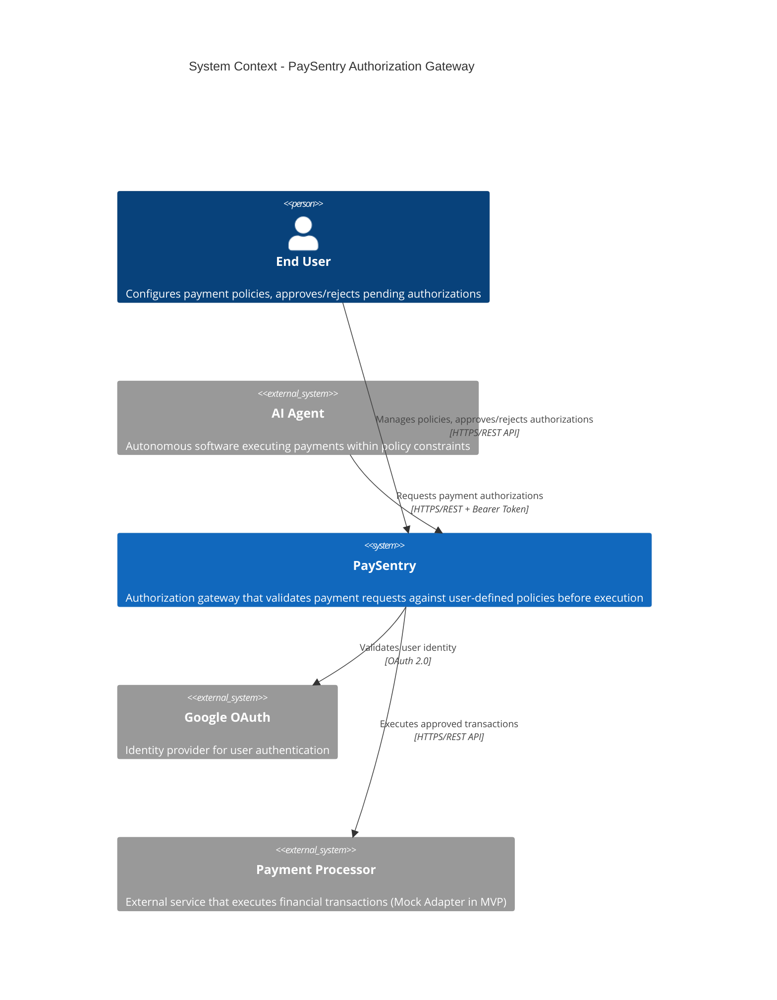

# System Context Diagram (C4 Level 1)

## Overview

This diagram shows PaySentry as a black box, identifying all external actors and systems that interact with it at runtime.

**Purpose:** Define system boundaries, external dependencies, and trust relationships.

---

## Diagram



---

## External Actors

| Actor | Type | Role | Protocol | Trust Level |
|-------|------|------|----------|-------------|
| **End User** | Person | Configures payment policies, approves/rejects authorizations manually when above threshold | HTTPS REST API (`/v1/policies`, `/v1/authorizations/:id/approve`) | **UNTRUSTED** - Input validation mandatory, OAuth authentication required |
| **AI Agent** | External System | Requests payment authorizations autonomously, captures approved authorizations | HTTPS REST API (`/v1/authorizations`, `/v1/authorizations/:id/capture`) with Bearer Token | **UNTRUSTED** - Even with valid token, all requests validated against policies (authentication ≠ trust) |
| **Google OAuth** | External Service | Provides user authentication and identity validation | OAuth 2.0 protocol (authorization code flow) | **TRUSTED** - Third-party identity provider with established SLA |
| **Payment Processor** | External Service | Executes financial transactions (transfers, payments). Mock Adapter in MVP, real API (BIND/MercadoPago) post-MVP | HTTPS REST API | **TRUSTED** - Third-party financial service with SLA and compliance certifications |

---

## Relationships

### User → PaySentry
- **Direction:** User initiates requests
- **Protocol:** HTTPS REST API
- **Authentication:** OAuth 2.0 (via Google)
- **Operations:**
  - Create/update/delete payment policies (`POST /v1/policies`)
  - Approve/reject pending authorizations (`POST /v1/authorizations/:id/approve`)
  - View transaction history (`GET /v1/transactions`)

### AI Agent → PaySentry
- **Direction:** Agent initiates requests
- **Protocol:** HTTPS REST API
- **Authentication:** Bearer token (bcrypt-hashed, long-lived, single delivery - see ADR-003)
- **Operations:**
  - Request authorization for payment (`POST /v1/authorizations`)
  - Capture approved authorization (`POST /v1/authorizations/:id/capture`)
  - Query authorization status (`GET /v1/authorizations/:id`)

### PaySentry → Google OAuth
- **Direction:** PaySentry initiates requests
- **Protocol:** OAuth 2.0 (token validation endpoint)
- **Purpose:** Validate user identity tokens received from frontend
- **Note:** Actual OAuth flow includes browser redirects (User → Google → User → PaySentry), but from system boundary perspective, PaySentry consumes Google's API for token validation

### PaySentry → Payment Processor
- **Direction:** PaySentry initiates requests (unidirectional)
- **Protocol:** HTTPS REST API
- **Mode:** Synchronous (PaySentry waits for transaction result in same request)
- **Operations:**
  - Execute approved payment/transfer
  - Query transaction status (if needed)
- **MVP Implementation:** Mock Adapter (in-process, no real API calls - see ADR-001)
- **Post-MVP:** Real integration with BIND APIBank or similar

---

## Trust Boundaries

### Critical Security Principle

```
authenticated ≠ trusted
```

**PaySentry exists because we don't trust authenticated actors to make correct financial decisions.**

### Trust Levels Explained

**UNTRUSTED Actors (User, Agent):**
- All input validated (schema, business rules, SQL injection protection)
- All requests pass through policy enforcement
- Authentication proves identity, NOT trustworthiness
- Example: Agent with valid token requesting $10M transfer when policy allows max $100 → **DENIED**

**TRUSTED Actors (Google, Payment Processor):**
- Third-party services with established SLAs and compliance
- PaySentry trusts their responses (e.g., "user identity confirmed", "transaction executed")
- Still requires error handling (network failures, service degradation)
- Does NOT trust availability (circuit breakers, timeouts, retries - see ADR-002 risk mitigation)

---

## System Boundary

### Inside PaySentry (controlled)
- Policy Engine
- Authorization logic
- Event Store (audit log)
- Mock Payment Adapter (MVP)

### Outside PaySentry (not controlled)
- User behavior
- Agent behavior
- Google OAuth availability
- Payment Processor availability
- Database infrastructure (Supabase managed PostgreSQL)

**Implication:** PaySentry must be resilient to failures of external dependencies (OAuth outage, Payment Processor downtime). See ADR-002 for SPOF mitigation strategies.

---

## Post-MVP Additions

The following actors are **out of scope for MVP** but documented for future reference:

| Actor | Role | Priority |
|-------|------|----------|
| **Email Service** (e.g., SendGrid) | Sends notifications for pending approvals, policy violations | Post-MVP |Si
| **Monitoring System** (e.g., DataDog, Sentry) | Receives metrics, logs, alerts | Post-MVP |
| **Webhook Consumers** | Third-party systems receiving PaySentry event notifications | Post-MVP |

---

## Connections to DDIA

### Chapter 1: Reliability, Scalability, Maintainability
- **Reliability:** System Context identifies all external failure points (Google, Payment Processor)
- **Maintainability:** Clear boundaries enable reasoning about impact of external changes

### Chapter 7: Transactions
- Trust boundaries inform transaction design: untrusted actors require atomic policy validation + execution

### Chapter 9: Consistency and Consensus
- Authentication ≠ trust → even with valid tokens, agents must pass consistency checks (policy enforcement)

---

## Related Documentation

- **ADR-001:** Mock Adapter justifies Payment Processor abstraction
- **ADR-002:** Transactional Event Log explains SPOF risk mitigation
- **ADR-003:** Agent Token Storage defines agent authentication mechanism
- **Requirements Spec:** Trust boundaries derived from NFR-003 (100% policy enforcement)
